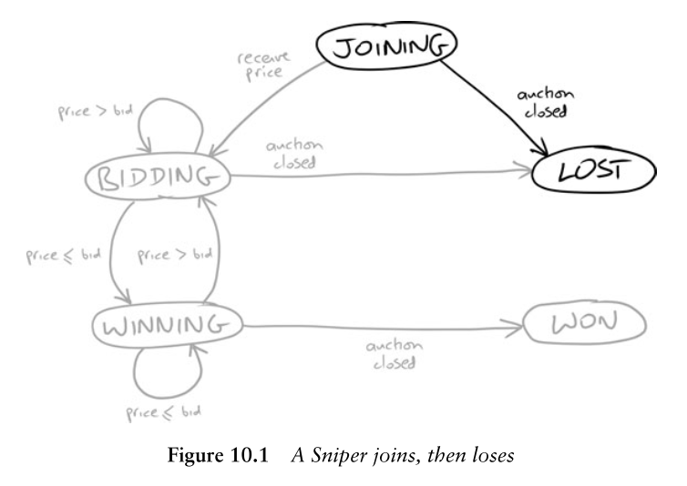
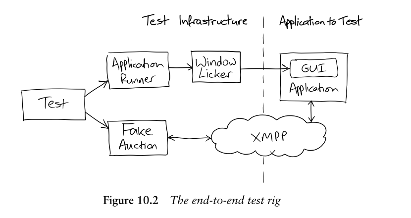

## GOOS

Growing Object-Oriented Software by Test Driven Development.

## Intents

- Learning Test Driven Software Development.
   - judging **where** to set the boundaries of **what** to test.
   - **how** to eventually cover everything.  
- Where we having to backtrack on decisions that turn out to be wrong.
- Learning to make substantial changes to the code in small, safe steps.

## Preparing to Work

- Generate a long requirements via the discussions.
- Slice up the functionality so that it can be built a little at a time in incremental development.
   - Each slice should be significant and concrete enough.
   - Each slice should be small enough to be focused on one concept and available quickly.
- The user can prioritizing the **user stories** / **features**.
- The order of each slice can be **adjusted** as we go along.

## First, Testing a Walking Skeleton

- The point of the walking skeleton helps us to **understand** requirements and **propose**/**validate** a broad-brush system structure.
- It's very important is to be able to **asess** the approach we've chosen.
- **Test** our decisions so we can make changes  with confidence later.
- The walking skeleton must **cover** all the components of our system.

## Why developing a walking skeleton takes a surprising amount of efforts?

- Decide **what to do** will flush out all sorts of questions about the application and its place in the world.
- The automation of **build**, **packaging** and **deploying** into production like environment will flush out all sorts of technical and organizational questions.

## Iteration Zero

In most agile projects, there's a first step where the team doing **initial analysis**, setting up its physical and technical environment, and otherwise getting started.
The team isn't adding much visible functionality since almost all the work is infrastructure, so it might not make sense to count this step as a conventional iteration for scheduling purpose.
One important task of Iteration Zero is to use the walking skeleton to test drive the initial architecture.

## Programming by Intention
Working backwards from the test helps us focusing on **what** the system want to do, instead of getting caught up in the complexity of **how** we will make it work.
  
1. Coding up a test to describe our intentions as clearly as possible, **given the expressive** limits of a programming language.
2. Building infrastructure to support the way we want to test the system, instead of writing a test to **fit in with** an existing infrastructure. 

## One Domain at a time

Keeping the language **consistent** helps us to understand what's significant in the test, with a nice side effect to protecting us when the implementation inevitably changes. 